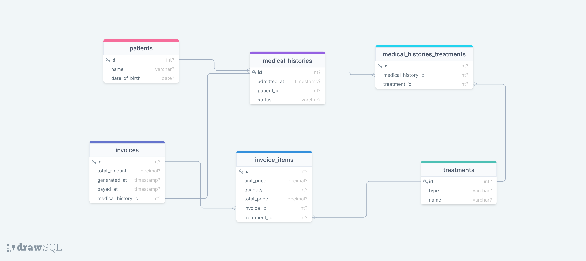

## Medical-Database

> In this project I have made a relational database using a given SQL diagram.

## SQL Diagram

## Getting Started

This repository includes files with plain SQL that can be used to recreate a database:

- Use [schema_based_on_diagram.sql](./schema_based_on_diagram.sql) to create all tables.
- Use [data.sql](./data.sql) to populate tables with sample data.
- Check [queries.sql](./queries.sql) for examples of queries that can be run on a newly created database. **Important note: this file might include queries that make changes in the database (e.g., remove records). Use them responsibly!**

## Technology

- PostgreSQL
- Linux Terminal

## Author

👤 **Tufahle Ahmed**

- GitHub: [@Tufahel](https://github.com/Tufahel)
- Twitter: [@TufahelAhmed](https://twitter.com/TufahelAhmed)
- LinkedIn: [@Tufahel-Ahmed](https://www.linkedin.com/in/tufahel-ahmed/)

## 🤝 Contributing

Contributions, issues, and feature requests are welcome!

Feel free to check the [issues page](../../issues/).

## Show your support

Give a ⭐️ if you like this project!

## Acknowledgments

- Microverse

## 📝 License

This project is [MIT](./MIT.md) licensed.
